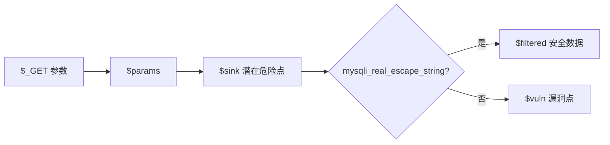

# 数据流敏感的代码漏洞检测

## 数据流方向

### 自顶向下（Top-Down）

从数据源（Source）开始追踪到所有可能的汇点（Sink）。

- 适合：污点分析、变量影响范围、数据依赖
- 特点：全面但计算开销较大

### 自底向上（Bottom-Up）

从汇点（Sink）开始反向追踪到可能的源点（Source）。

- 适合：特定漏洞检测
- 特点：更快定位潜在漏洞

## 实战：使用 `<dataflow>` 过滤数据流路径

### 1. 生成数据流

```syntaxflow
_GET.* as $params;
$params --> * as $sink;
alert $sink;
```

`$params --> *` 实现 Bottom-Use 分析，追踪从 Source 到 Sink 的完整数据流。

### 2. 编写过滤语句

使用 `<dataflow>` NativeCall 过滤数据流路径，只保留未经过安全处理的路径：

```syntaxflow
_GET.* as $params;
$params --> * as $sink;

$sink<dataflow(<<<CODE
*?{opcode: call && <getCaller><name>?{have: mysqli_real_escape_string}} as $__next__
CODE)> as $filtered;
$sink - $filtered as $vuln;

alert $vuln;
```

**逻辑解释：**

1. `_GET.* as $params`：收集用户输入
2. `$params --> * as $sink`：追踪所有潜在危险使用点
3. `$sink<dataflow(...)> as $filtered`：在数据流路径上检查是否调用了 `mysqli_real_escape_string`，经过安全处理的路程存入 `$filtered`
4. `$sink - $filtered as $vuln`：差集得到未经过滤的漏洞点
5. `alert $vuln`：报告漏洞

### 3. Heredoc 与 `$__next__`

- `<<<CODE ... CODE`：Heredoc 语法定义多行规则片段
- `$__next__`：在 dataflow 块中，满足条件的点会赋值给 `$__next__`；若 `$__next__` 非空，当前路径会被保留（即经过过滤函数）；否则路径会被排除

## SQL 注入检测规则完整流程



## 最佳实践

1. 对所有用户输入进行适当的过滤和转义
2. 使用预处理语句而不是直接拼接 SQL
3. 定期进行类似的静态代码分析
