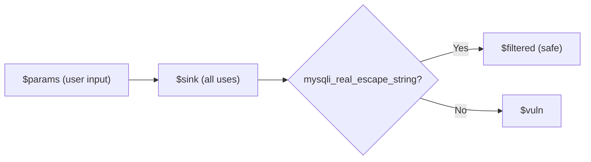

# Practice: Dataflow with Filter (Sanitizer Awareness)

## Objective

Use `-->` for dataflow and `<dataflow>` to exclude paths that pass through a sanitizer (e.g., `mysqli_real_escape_string`). Only report sinks that are *not* sanitized.

## Rule: SQL Injection with Sanitizer Filter

```syntaxflow
desc(title: "sql-injection-unsanitized")

_GET.* as $params;
$params --> * as $sink;

$sink<dataflow(<<<CODE
*?{opcode: call && <getCaller><name>?{have: mysqli_real_escape_string}} as $__next__
CODE)> as $filtered;
$sink - $filtered as $vuln;

alert $vuln;
```

## Breakdown

1. **`_GET.* as $params`**: Collect user input from superglobals
2. **`$params --> * as $sink`**: Bottom-use analysis — trace all uses of `$params` to potential SQL sink sites
3. **`$sink<dataflow(...)> as $filtered`**: In the dataflow path, check if `mysqli_real_escape_string` is called. If so, assign to `$__next__` and the path is kept in `$filtered` (i.e., sanitized)
4. **`$sink - $filtered as $vuln`**: Set difference — paths that never pass through the sanitizer are vulnerabilities
5. **`alert $vuln`**: Report only unsanitized paths

## Heredoc and `$__next__`

- **`<<<CODE ... CODE`**: Heredoc defines a multi-line rule snippet passed to `<dataflow>`
- **`$__next__`**: Inside the dataflow block, a non-empty `$__next__` means "this path satisfies the filter" (e.g., passed through sanitizer); empty means "exclude this path"

## Flow Diagram



## Key Concepts

- Use `-->` for full bottom-use dataflow
- Use `<dataflow>` to apply path-level conditions
- Use set difference (`-`) to remove sanitized paths before alerting
